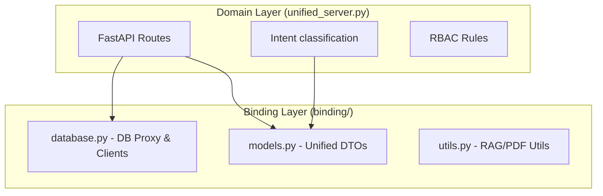

# Backend Modernization: The Binding Layer Strategy

## 🎯 The Core Problem: "The God File"
Originally, `unified_server.py` in the `modalgateway-Tops-1` project was a monolith. It contained database transport logic, Pydantic models, RAG utilities, AND business logic (RBAC, intent classification). This made testing infrastructure independent of domain logic impossible.

## 🚀 The Solution: Binding Layer Extraction
We extracted a **Passive Library** located at `binding/`. This package acts as the coordination layer for the entire backend.

### 1. Structural Separation


### 2. File-by-File Breakdown
- **`binding/database.py`**: 
    - Implemented a `SupabaseProxy` that dynamically switches between **TalentOps** and **Cohort** credentials based on a `ContextVar`.
    - Centralized `SimpleSupabaseClient` for consistent HTTP transport.
- **`binding/models.py`**:
    - Unified all Pydantic Request/Response models (`SLMQueryRequest`, `RAGQueryRequest`).
    - Established a strict contract between the Frontend and the Model Gateway.
- **`binding/utils.py`**:
    - Isolated stateless utility functions for text chunking, embedding generation, and PDF parsing.

### 3. Passive Library Principle
The binding layer **never self-initializes**. It doesn't read `.env` files or create connections on import. 
Instead, the host (`unified_server.py`) explicitly calls:
1. `init_db(...)`: Sets up connection pools.
2. `init_rag(...)`: Injects the AI client.

This prevents race conditions and "import-time" side effects.

## 🛠️ Multi-Tenant Support
The binding layer solved the multi-tenant challenge using **Application-Scoped Routing**:
```python
# The internal logic of select_client()
def select_client(app_name):
    if app_name == "cohort":
        current_supabase_client.set(cohort_supabase)
    else:
        current_supabase_client.set(talentops_supabase)
```
This ensures that a request for "Cohort" never accidentally touches "TalentOps" data.

---
## 📈 Impact of Modernization
- **Stability**: Zero circular imports due to strict one-way dependency management.
- **Extensibility**: Adding a 3rd tenant now requires only 5 lines of code in `database.py` rather than a full server refactor.
- **Clarity**: Engineers can now distinguish between "How we talk to the DB" (Binding) and "What we say to the DB" (Server).
