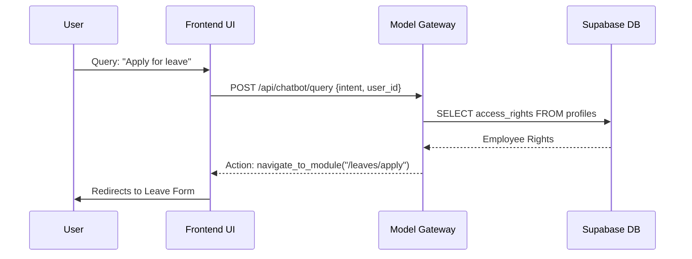

# Frontend Dashboard Architecture

## 🎨 Role-Based Interface Design
The `talentops-ottobon` frontend is built on a **Role-Scoped Dashboard** pattern. This ensures users only see what is relevant to their permissions.

### User Roles & Pathways
- **Executive**: Focused on High-Level Analytics, Hiring Portals, and Global Payroll.
- **Manager**: Focused on Team Management, Leave Approval, and Task Distribution.
- **Team Lead**: Focused on Technical Coordination and Task Tracking.
- **Employee**: Focused on Personal Output, Document Management, and Leave Requests.

## 🏗️ Technical Stack
- **React + Vite**: For blazing-fast development and optimized bundles.
- **TailwindCSS**: For a unified design system that supports Dark Mode natively.
- **TypeScript**: Enforcing strict type safety for data coming from the Model Gateway.

## 🔄 Data Lifecycle

## 🛠️ Key Module Features

### 1. Messaging Hub
A sophisticated chat interface (`shared/MessagingHub.jsx`) supporting:
- Direct Messages (DMs).
- Team Channels.
- Org-wide Announcements.
- Real-time updates via Supabase WebSockets.

### 2. Task Management & Points System
A gamified task system where points are calculated automatically:
- **Formula**: `Base (Hours x 10) + Early Bonus - Late Penalty`.
- **Implementation**: Trigger-based in the database, visualized in `AllTasksView.jsx`.

### 3. Performance & Hiring
- **ATS Integration**: Detailed tracking of applicants from interview to offer letter.
- **Performance Grids**: Visual representation of employee technical and soft-skill scores.

## 🔐 Client-Side Security
- **RoleGuard**: A higher-order component that protects routes.
- **Supabase JS Client**: Uses direct row-level security (RLS) for auth and personal data reads.
